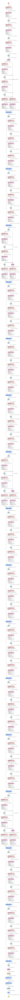

<big><b>生态监测大数据平台项目设计文档</b></big>

# 1 系统需求分析

## 1.1可行性分析

**市场可行性:**

  广大科研人员有时需要对生态环境如虫害植被等进行准确、及时的预测，甚至有时还需要进行多天的实地考察，本项目为广大科研人员收集生态信息，环境监测提供了便利。

**技术可行性:**

  主要分析技术条件能否顺利完成开发工作，硬、软件能否满足开发者的需要等。该项目采用了Browser/Server模式进行开发。Browser/Server体系结构紧密的结合了Internet技术，是技术发展的大势所趋，它把网站带入了一个崭新的发展时代。数据库服务器MySQL数据库，它能够处理大量数据，同时保持数据的完整性并提供许多高级管理功能。它的灵活性、安全性和易用性为数据库编程提供了良好的条件。使用的算法是ResNet，本算法top5错误率为3.57%。该网络使用了残差结构，通过堆叠多个残差结构从而构建了ResNet网络。实验表明使用残差块可以有效地提升收敛速度和精度。由于ResNet卓越的性能，越来越多的来自学术界和工业界学者和工程师对其结构进行了改进，其中ResNet-vd的参数量和计算量与ResNet几乎一致，但是结合适当的训练策略，最终的精度提升高达2.5%。因此，项目的开发平台已成熟可行。

## 1.2项目要解决的问题

  首先，因为该项目是面向科研技术人员的，所以在数据量方面可能会很大。其次就是，因为遇到紧急情况需要及时处理，具有不确定性和不稳定性，故要考虑到大量数据查询，算法优化，系统及时性等诸多问题。

## 1.3项目目标

  生态监测大数据平台是通过遥感、虫类、鸟类、植被来监测生态系统的情况，不仅提高劳动效率，监测结果准确性也大大提高，为广大科研人员提供准确、及时的预报服务。

# 2 功能设计

## 2.1功能划分

该项目包含以下7大功能模块：

1.虫类鸟类数据维护

2.无人机监测数据维护

3.深度学习模型

4.用户登录功能

5.用户上传图片

6.边缘计算节点

7.虫类鸟类知识图谱推理

## 2.2功能描述

### 2.2.1 虫类鸟类数据维护

  用户通过后台管理系统可实时查看害虫具体信息。

### 2.2.2 无人机监测数据维护

  用户通过后台管理系统可实时查看无人机监测数据。

### 2.2.3 用户登录功能

  因此系统不面向大众开放，所以此系统账号由管理员配置好权限后统一发放

### 2.2.4 深度学习模型

  本项目使用的深度学习框架是飞桨，网络使用ResNet，有以下几个主要的原因：(1)ResNet在业界已经被广泛使用与验证，ResNet_vd是对ResNet的高效改进，预测耗时几乎没有增加，精度却有显著提升。(2)ResNet系列模型的训练与预测速度经过了大量的优化。

### 2.2.5 用户上传图片

  这是生态数据来源之一，由用户拍照上传至系统后，由深度模型过筛后将信息存储入数据库中后再在页面上进行展示

### 2.2.6 边缘计算节点

  在树莓派端进行，对数据传输上进行优化，提高效率

### 2.2.7 害虫知识图谱推理

 1.对害虫的百科数据进行知识图谱存储

 2.根据知识图谱的关系，获取害虫数量间变化的关系

 3.将数据进行关系网可视化展示

## 2.3功能设计

### 2.3.1技术选型

 Vue2.x + DataV + Echarts + Webpack + Nodejs +MySQL8.0 + Python3.6 + Django2.2.5

### 2.3.2 项目架构

### 2.3.2 深度学习

  使用的深度学习框架是飞桨，算法是ResNet。该网络使用了残差结构，通过堆叠多个残差结构从而构建了ResNet网络。实验表明使用残差块可以有效地提升收敛速度和精度。由于ResNet卓越的性能，越来越多的来自学术界和工业界学者和工程师对其结构进行了改进，其中ResNet-vd的参数量和计算量与ResNet几乎一致，但是结合适当的训练策略，最终的精度提升高达2.5%。

  本项目使用ResNet，有以下几个主要的原因：(1)ResNet在业界已经被广泛使用与验证，ResNet_vd是对ResNet的高效改进，预测耗时几乎没有增加，精度却有显著提升。(2)ResNet系列模型的训练与预测速度经过了大量的优化。

# 3 详细设计

## 3.1后台设计

  	使用Vue.js作为前端框架，代替Django本身自带的模板引擎，Django则作为服务端提供API接口，从而实现前后端分离。页面具体模块：害虫管理，无人机管理，权限认证

## 3.2前台设计

  	在Github上选用了一个基于 Vue、Datav、Echart 框架的 " 数据大屏项目 "，通过 Vue 组件实现数据动态刷新渲染，对内部图表进行替换，部分图表使用 DataV 自带组件，项目需要全屏展示（按 F11），具体请查看项目文件中的README.md.

# 4 数据操作及表格设计

详见db文件夹中《数据库设计文档》

# 5 开发环境

## 5.1开发工具

本项目选择了用关系型数据库MySQL8.0来作为数据库软件，选用PowerDesigner 16.5作为数据库设计软件。选用PyCharm、Visual Studio Code软件作为开发工具

## 5.2开发环境

Windows，linux平台

## 5.3 项目预览

